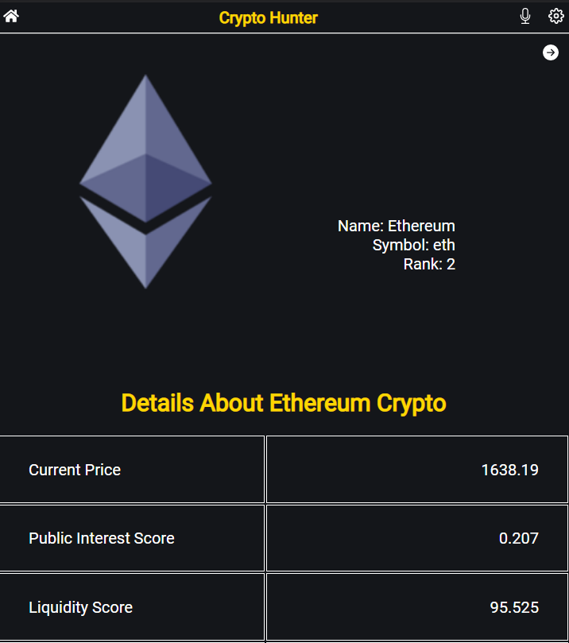
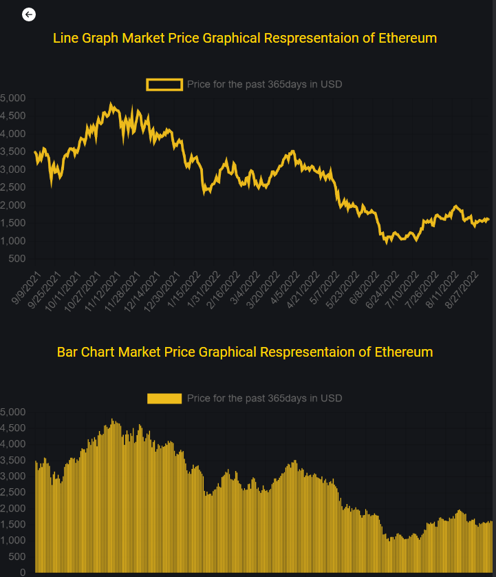

## Crypto Hunter
This is a web application that provides numerical data of any cryptocurrency.
It consists of three pages: 
   - Home Page: This page displays a list of cryptocurrencies together with their name, symbol, and current price in the market.
   - Details Page: This page displays numerical information about the chosen coin.
   - HistoricalChart Page: this page displays the line and bar graph representation of the coin's numerical data.
###### Home Page
   
 
###### Details Page
   
 
###### HistoricalChart Page
 
 
 
### Built With
- React
- Redux
- CSS
- JavaScript
- Chart.js
- API
  
### Live Demo
- [Crypto Hunter](https://admirable-chimera-5ddbb5.netlify.app/)
- [Vedio](https://drive.google.com/file/d/1xoXsbl5HFcQWJ6SYrD5sAt_o1wvtSeIz/view?usp=sharing)

### Getting Started
To get a local copy up and running follow these simple example steps.

###### Prerequisites:
Any kind of browser and code editor.

###### Setup:
   1. Clone the repository (https://github.com/Ney2/crypto-hunter)
   2. Then open the folder in your local environment using any code editor
   3. Open terminal
   4. Change the directory in your terminal to the repository
   5. Type npm start in your terminal, this will open the project in your browser

### Author 1
- GitHub: [@Ney2](https://github.com/Ney2)
- Twitter: [@KidistGuta](https://twitter.com/GutaKidist)
- LinkedIn: [@KidistDinku](https://www.linkedin.com/in/kidist-guta-014025183/)

### 🤝 Contributing
Contributions, [issues](https://github.com/Ney2/crypto-hunter/issues), and feature requests are welcome!

### Show your support
Give a ⭐️ if you like this project!

### Acknowledgments
Original design idea by [Nelson Sakwa on Behance](https://www.behance.net/sakwadesignstudio).

### 📝 License
This project is [MIT](https://github.com/Ney2/readme-template/blob/master/MIT.md) licensed.
